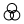

# Практична робота №5  
Тема: Криві Безьє та векторні об’єкти у Figma. Створення іконок у векторному форм
## Хід роботи
1. Ознайомилася з розділами №9 (Перо) і №10 (Векторні мережі) у Керівництві користувача Figma.  
2. Для тренування роботи з кривими Безьє виконала вправи на сайті [The Bezier Game](https://bezier.method.ac/?authuser=0).  
3. За допомогою інструмента Pen Tool створила п’ять векторних іконок у обводковому стилі (розмір 24×24 px).  
4. Кожна іконка виконана окремо у своєму фреймі.  
## Результати роботи
### Іконка 1
  
### Іконка 2
  
### Іконка 3
  
### Іконка 4
  
### Іконка 5
  
## Посилання на дизайн у Figma
[Переглянути дизайн у Figma](https://www.figma.com/design/Hjr479PXlbE4KclKjGf6im/Untitled?node-id=0-1&t=2Sg7LA1po9fNDnPs-1).
## Висновок
Під час виконання практичної роботи я навчилася користуватися інструментом Pen Tool для побудови кривих Безьє, створювати векторні лінії та прості іконки у Figma.  
Отримані навички допомагають краще розуміти роботу з векторною графікою та застосовувати її під час розробки інтерфейсів.
